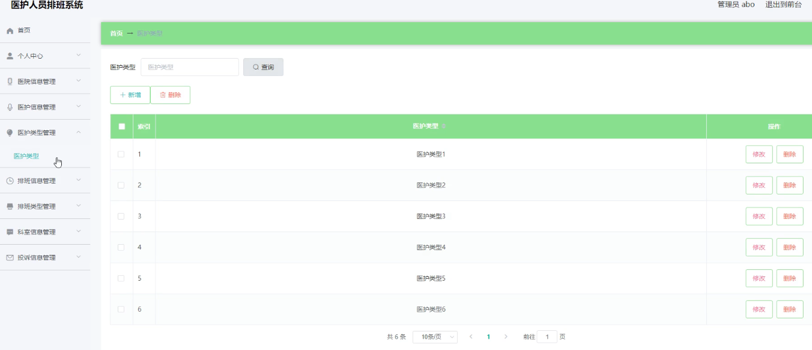
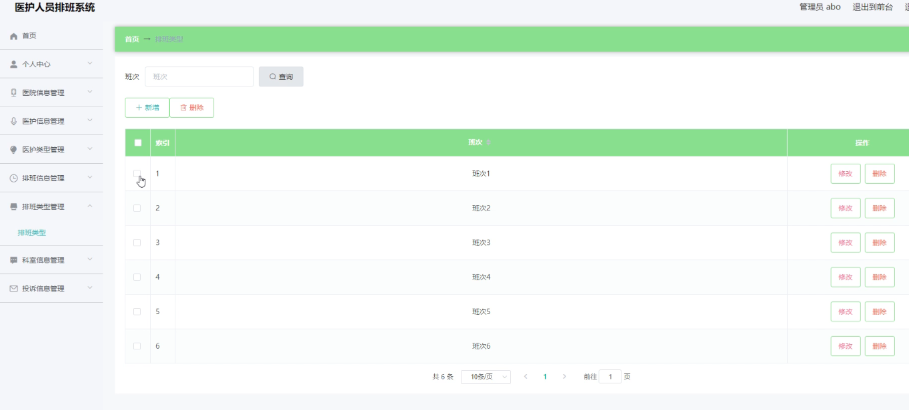
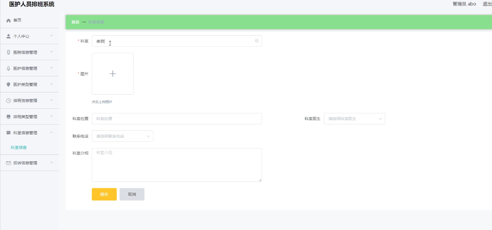
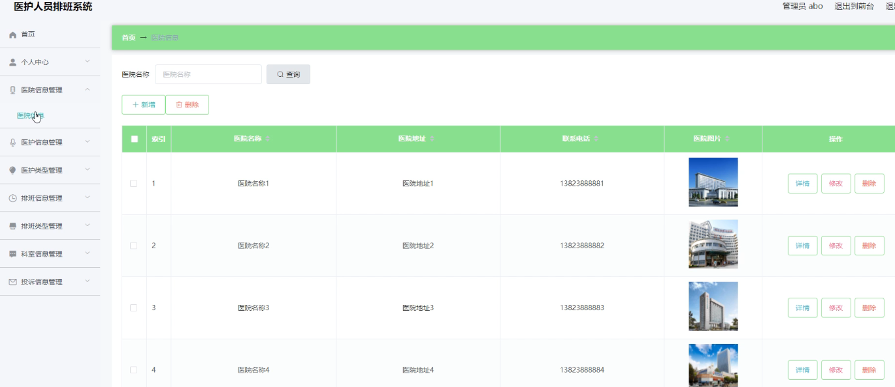
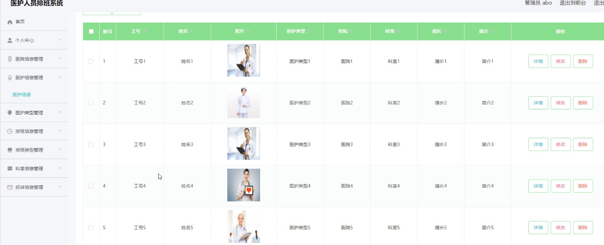

基于Springboot的医护人员排班系统（程序+论文）
=
### 完整代码获取地址：从戎源码网 ([https://armycodes.com/](https://armycodes.com/))
### 作者微信：19941326836  QQ：952045282 
### 承接计算机毕业设计、Java毕业设计、Python毕业设计、深度学习、机器学习
### 选题+开题报告+任务书+程序定制+安装调试+论文+答辩ppt 一条龙服务
### 所有选题地址https://github.com/nature924/allProject

一、项目介绍
---
系统包含两种角色：用户、管理员，系统主要功能如下：

医护类型管理：管理员可以添加、修改、删除医护类型，确保系统能够区分不同类型的医护人员。

排班类型管理：允许管理员定义不同的排班类型，包括添加新类型、修改类型属性以及删除不再需要的类型。

科室信息管理：提供对科室信息的添加、修改和删除功能，以维护准确的科室信息记录。

医院信息管理：管理员可以管理医院的基本信息，包括名称、地址和联系方式，确保信息始终保持最新和准确。

医护信息管理：允许管理员添加、修改和删除医护人员的详细信息，包括姓名、职称和联系方式等。

二、项目技术
---
- 编程语言：Java
- 数据库：MySQL
- 项目管理工具：Maven
- 前端技术：VUE、HTML、Jquery、Bootstrap
- 后端技术：Spring、SpringMVC、MyBatis

三、运行环境
---
- 操作系统：Windows、macOS都可以
- JDK版本：JDK1.8以上都可以
- 开发工具：IDEA、Ecplise、Myecplise都可以
- 数据库: MySQL5.7以上都可以
- Tomcat：任意版本都可以
- Maven：任意版本都可以

四、运行截图
---
### 论文截图：

### 程序截图：

